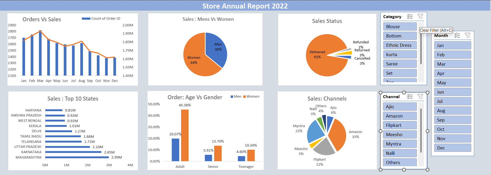

# 📊 Store Sales Data Analysis Dashboard (Excel)

An interactive **Microsoft Excel Dashboard** created to analyze **Store's 2022 sales data**. The dashboard provides meaningful business insights through data visualization, helping identify customer behavior, sales trends, and opportunities to improve sales performance in 2023.

---

## 📌 Project Objective

The objective of this project is to analyze Store's annual sales data for **2022** and create an interactive dashboard that answers key business questions, enabling better decision-making and sales growth strategies for **2023**.

---

## 🛠️ Tools & Technologies

- Microsoft Excel
- Pivot Tables
- Pivot Charts
- Slicers
- Conditional Formatting
- Data Cleaning
- Data Visualization
- Dashboard Design

---

## 📂 Project Files

```
📦 Store Data Analysis
├── 📄 Store Data Analysis.xlsx
├── 📄 Store Data Analysis - Raw Data.xlsx
├── 🖼️ Dashboard.png
└── 📄 README.md
```

---

## 📊 Dashboard Overview

The dashboard includes interactive visualizations for:

- 📈 Monthly Sales vs Orders
- 👨👩 Sales by Gender
- 📦 Order Status Distribution
- 🗺️ Top 10 States by Sales
- 👥 Age Group vs Gender Analysis
- 🛒 Sales by Sales Channel
- 🎯 Interactive Slicers (Month, Category & Channel)

---

## ❓ Business Questions Answered

- Compare **Sales and Orders** using a single chart.
- Which **month** recorded the highest sales and orders?
- Who purchased more in 2022: **Men or Women**?
- What are the different **Order Statuses**?
- Which are the **Top 10 States** contributing to sales?
- What is the relationship between **Age Group and Gender**?
- Which **Sales Channel** generated the maximum sales?
- Which **Product Category** sold the most?

---

## 📈 Key Insights

- 👩 Women contributed **64%** of total sales, while Men contributed **36%**.
- 📍 Maharashtra, Karnataka, and Uttar Pradesh are the **Top 3 revenue-generating states**.
- 👥 Customers aged **30–49 years** contributed nearly **50%** of total sales.
- 🛍️ Amazon, Flipkart, and Myntra together generated approximately **80%** of total sales.
- 📦 Around **92%** of all orders were successfully delivered.

---

## 💡 Business Recommendations

To improve sales in 2023, Store should:

- Target **Women customers** aged **30–49 years**.
- Focus marketing campaigns in **Maharashtra, Karnataka, and Uttar Pradesh**.
- Increase promotions and discounts on **Amazon, Flipkart, and Myntra**.
- Continue maintaining high delivery success while minimizing returns and cancellations.
- Launch personalized offers and festive campaigns for high-value customers.

---

## 📷 Dashboard Preview



---

## 📊 Dashboard Features

- Interactive Dashboard
- Dynamic Slicers
- Pivot Tables
- Pivot Charts
- KPI-Based Visualizations
- User-Friendly Interface
- Easy Data Filtering

---

## 🚀 Skills Demonstrated

- Data Cleaning
- Data Analysis
- Business Intelligence
- Dashboard Development
- Data Visualization
- Microsoft Excel
- Pivot Tables
- Pivot Charts
- Slicer Integration
- Business Insight Generation

---

## 📚 What I Learned

- Cleaning and preparing raw datasets.
- Building interactive dashboards in Excel.
- Creating Pivot Tables and Pivot Charts.
- Using slicers for dynamic filtering.
- Identifying business trends from sales data.
- Presenting insights in a professional dashboard.

---

## 🔮 Future Enhancements

- Add Profit & Loss Analysis
- Build Power BI Dashboard
- Automate data refresh using Power Query
- Add Sales Forecasting
- Include Customer Segmentation Analysis

---

## 👨‍💻 Author

**Dhananjay Bachal**

Electronics & Telecommunication Engineering Student | Aspiring Data Analyst

- 💼 LinkedIn: https://www.linkedin.com/in/dhananjay-bachal-09a6aa2b5/
- 🐙 GitHub: https://github.com/DhananjayBachal

---

## ⭐ Support

If you found this project helpful, please consider giving it a **⭐ Star** on GitHub. Your support motivates me to create more data analytics projects!

---
**Thank you for visiting this repository! 🚀**